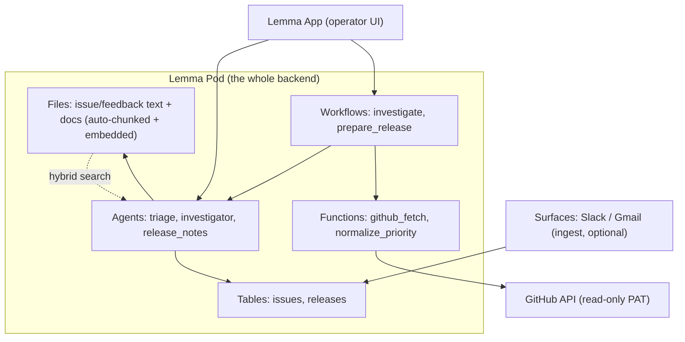

# Forge — AI Bug Triage & Release Operator
### Final PRD · Gappy AI National Hackathon (Powered by Lemma SDK)

> **Problem statement:** ENGINEERING — *AI Bug Triage & Release Operator* (curated track).
> **Build window:** June 24–30, 2026 · **Submit:** June 30 · **Results:** ~July 8.
> **Team:** solo or up to 3. **Submission =** problem + approach + **screen recording** + team details (no deck).
> **Product name:** Forge. (Gappy AI is the *organizer*, not the product — no "Gappy" branding in the build.)

---

## 0. How this PRD is scored (read this first)

The judges publish their weights. Every decision in this doc is justified against them:

| Weight | Criterion | What it means for Forge |
|---|---|---|
| **35%** | Problem clarity & real-world fit | One specific persona (Alex, founding engineer), one real pain (feedback chaos → slow triage), demoed on **real GitHub data**. |
| **25%** | Product judgment — *"any wasted complexity?"* | **This is why the scope is small.** We cut everything Lemma already provides or that doesn't show in the demo. The cut list (§8) is a feature, not an apology. |
| **25%** | Execution — *does the core loop work?* | One loop, working end-to-end, recordable in 3 minutes. Polish is explicitly optional per the rules. |
| **15%** | SDK utilisation — *meaningful, not superficial* | Forge is built **on** Lemma primitives — Tables, Files (hybrid search), Agents, Workflows, Functions, Surfaces, App — not bolted onto a custom stack. |

> **Hiring-track note:** top builders are judged on *how they scoped and defended decisions.* This PRD's explicit cut list and rationale (§8) is itself part of the deliverable — keep it; it's the argument you'll make in the interview.

---

## 1. One-paragraph summary

Forge turns messy engineering feedback — GitHub issues, Slack complaints, support emails — into an organized, prioritized issue queue, investigates the hard ones with a multi-step AI workflow that cites real evidence, and prepares release notes on command. It is built entirely on the Lemma SDK: feedback lands in a Lemma **Table**, raw text is indexed as Lemma **Files** for hybrid semantic search (duplicate detection and RAG, no vector DB), a triage **Agent** scores and de-dupes, an investigation **Workflow** synthesizes a root-cause hypothesis with clickable evidence, and the team works from a Lemma **App**.

---

## 2. The user and the pain (the 35%)

**Primary persona — "Alex," founding engineer / dev lead at a 5–15 person startup.** Alex is the de-facto triager. Bugs and complaints arrive across GitHub, a `#bugs` Slack channel, and support email. The cost isn't writing fixes — it's the *triage tax*: re-reading every report, guessing severity, spotting that #142 is the same crash as #119, hunting the commit that probably caused it, and hand-writing release notes on Friday.

**The one sentence that defines the product:** *"Make the next critical bug, and the context to fix it, the first thing Alex sees — without Alex sorting anything."*

We do **not** build for SREs, PMs, judges-as-users, or "developers in general." One persona keeps the demo sharp and the scope honest.

**Why Lemma fits (per the rules):** this is a real, login-gated workflow product — not a static site, public no-login app, or one-off chatbot. It manages ongoing work and writes state back.

---

## 3. Scope — the hero loop

**The core loop that must work end-to-end (this is the screen recording):**

```
Ingest feedback  →  Triage agent scores + de-dupes  →  Priority Queue
        →  Investigate one issue (Workflow, with evidence)
        →  Prepare release notes (one command)
```

### MVP features (must work)
1. **Ingest** — pull real open issues from a public GitHub repo (read-only PAT) + a seeded set of Slack/email messages → one Lemma **Table** (`issues`); each item's text written to **Files** for search.
2. **Triage Agent** — for each new item: assign `priority` (Critical/High/Normal/Low), generate reproduction steps, write back to the Table.
3. **Duplicate linking** — `pod.files.search(search_method="HYBRID")` finds similar prior issues; link them in the Table (powers "this is the 4th report of the same crash").
4. **Priority Queue (App)** — the home screen: critical first, each card showing title, priority, repro steps, and "N related."
5. **AI Investigation (Workflow)** — on demand for one issue: a Lemma Workflow that gathers a stack-trace reading, related recent commits (GitHub), and similar past issues (file search), then synthesizes a **root-cause hypothesis with clickable evidence links**.

### Closing flourish (build only if Day 4 is on track)
6. **Release Center** — `prepare release` gathers merged PRs since the last tag (GitHub), an Agent groups them (Added/Fixed/Changed) and drafts release notes for review.

### Explicitly out of scope for the build (see §8 for why)
Bug graph, analytics dashboard, command palette, Slack/email *write-back*, CI/Sentry, breaking-change diff analysis, auth/OAuth, multi-repo, observability stack.

> **Demo priority order if time runs short:** 1→2→3→4→5 must all work. 6 is the bonus. If 5 is at risk, a *pre-recorded* investigation run is an acceptable fallback (the rules allow screen recordings).

---

## 4. Architecture — Lemma is the stack



**No Postgres, no Redis, no Qdrant/Pinecone, no custom FastAPI backend.** Tables = structured data, Files = search/RAG, App = UI. The only thing we host is the App and a model API key.

### Lemma primitive map (this is the 15% SDK story — make it visible in the demo)
| Lemma primitive | Used for |
|---|---|
| **Tables** | `issues` (id, source, title, body, priority, repro_steps, status, related_ids, linked_prs), `releases` (version, notes, pr_ids) — row-level, owned by the pod |
| **Files** | Every issue/feedback body + any product docs, auto-chunked & embedded → `pod.files.search(..., "HYBRID")` is our dedup + RAG with **no vector DB** |
| **Agents** | `triage` (classify + repro + dedup), `investigator` sub-steps, `release_notes` |
| **Workflows** | `investigate` (graph: gather evidence → synthesize), `prepare_release` (collect PRs → group → draft) |
| **Functions** | `github_fetch` (issues/PRs/commits via PAT), `normalize_priority` (validate the agent's JSON into the enum) |
| **Surfaces** | Slack + Gmail ingestion if time allows; otherwise seeded JSON into the same Table |
| **App** | The operator UI (single-file HTML or React on pod APIs) |

### Real SDK calls
> **Corrected 2026-06-26 against the installed `lemma-sdk==0.5.0`.** The block below
> was originally guessed and was wrong in three places (import path, env vars,
> `files.write`). The D1 lines (records / files / tables) are now verified by
> running them live on pod `forge`. The D2+ lines (conversations / workflows) are
> the documented shapes and will be confirmed when those days are built.
```python
from lemma_sdk import Pod          # NOT `from lemma import Pod`
pod = Pod.from_env()               # reads LEMMA_TOKEN + LEMMA_POD_ID (or ~/.lemma CLI session)

# --- VERIFIED D1 ---
# Ingest: write a feedback item as a row + a searchable file
pod.records.create("issues", {"id": "gh_142", "source": "github", "title": t, "body": b,
                              "status": "new", "related_ids": [], "linked_prs": []})
pod.files.write_text(f"/issues/{issue_id}.md", f"# {t}\n\n{b}")   # `write_text`, not `write`; auto-indexed

# Duplicate detection — no vector DB, this IS the feature (search is async; poll/retry):
hits = pod.files.search(new_issue_text, scope_path="/issues", search_method="HYBRID")

# --- D2+ shapes (confirm when building) ---
# Triage: run the agent over a conversation
conv = pod.conversations.create_for_agent("triage", title=f"Triage {issue_id}")
pod.conversations.send(str(conv.to_dict()["id"]), f"Classify and write repro for issue {issue_id}")

# Investigation as a workflow:
run = pod.workflows.create_run("investigate").to_dict()
pod.workflows.submit_form(run["id"], node_id="<issue_form>", inputs={"issue_id": issue_id})
# NOTE: Lemma collects workflow inputs via FORM nodes MID-RUN, not at start — design the
# `/release <version>` and `investigate <id>` entry points around a form node, not a start arg.
```

---

## 5. Duplicate detection (kept deliberately simple)

1. New issue text → `pod.files.search(query, "HYBRID")`, top 5.
2. If top hit is strongly similar, ask the `triage` agent a single yes/no: *"Are these the same underlying issue? Answer YES/NO + one-line reason."*
3. On YES → write the match into `related_ids` on both rows.

No tunable cosine thresholds in the UI, no clustering service, no fingerprint table. Files' hybrid search + one LLM confirmation is enough and demos cleanly ("Forge already saw this crash 3 times").

**Honesty rule:** show **evidence, not fake percentages.** Display *"3 related reports · likely cause in `auth/cache.py` · commit a1b2c3"* with clickable links — never a fabricated "91% confidence." (The original draft admitted the % was "simulated by phrasing"; cut it.)

---

## 6. Timeline (6 working days · June 25–30, scaled for a team of 1–3)

> You are starting **June 25** (SDK live since the 24th). Day 0 already happened; plan for ~5 build days + submit.

| Day | Goal | Tasks | "Done" looks like |
|---|---|---|---|
| **D1 · Jun 25** | Lemma fluency + spine | Stand up a pod. Define `issues` Table. Write + search a Markdown File. Run a stock agent via a conversation. `github_fetch` Function pulling real issues. | Real GitHub issues land in the Table; `files.search` returns hits. |
| **D2 · Jun 26** | Triage works | Build `triage` agent (priority + repro). `normalize_priority` Function. Seed Slack/email JSON into the Table. | Every issue has an AI priority + repro steps written back. |
| **D3 · Jun 27** | Queue + dedup | Lemma **App**: Priority Queue screen (critical-first cards). Wire HYBRID-search dedup + `related_ids`. | Alex opens Forge, sees ranked issues with "N related." |
| **D4 · Jun 28** | Investigation Workflow | `investigate` Workflow: gather stack-trace reading + commits + similar issues → synthesized hypothesis with evidence links. App view to trigger + display. | `investigate <id>` returns a cited root-cause hypothesis live. |
| **D5 · Jun 29** | Flourish + harden | Release Center (only if on track). Otherwise: kill bugs, polish the loop, seed clean demo data, **record a backup video**. | Core loop is stable end-to-end; backup recording exists. |
| **D6 · Jun 30** | Submit | Final screen recording, problem/approach writeup, team details. | Submitted before deadline. |

**If 2nd/3rd teammate:** parallelize — one owns the App (D3–D5), one owns Agents/Workflows (D2–D4), one owns ingestion + GitHub Function + demo data (D1–D2, then demo prep). Solo: drop Release Center early and protect the investigation Workflow.

**Tech you bring (per rules):** your IDE + coding agent (Claude Code etc.), a model API key (e.g. an Anthropic Claude model for the agents), and hosting for the App. Lemma provides the rest.

---

## 7. The submission (what actually gets judged)

A **3-minute screen recording** + a short writeup. Storyboard:

1. **The pain (15s):** "Alex's feedback is scattered across GitHub, Slack, email. Triage eats his mornings."
2. **Ingest → Queue (30s):** Forge pulls real issues; the Priority Queue shows criticals first, each with AI repro steps. *"Forge read every report and ranked them — Alex sorted nothing."*
3. **Dedup (20s):** Open a critical bug → *"3 related reports"* with links. *"It already knew this was the same crash."*
4. **Investigate (45s):** Run the Workflow live → watch evidence gather → root-cause hypothesis with a clickable commit + similar-issue links. *"Evidence, not vibes."*
5. **Release notes (20s, if built):** One command → grouped, drafted notes. *"Friday's hour, in seconds."*
6. **The Lemma point (15s):** Show the pod — *"Tables, Files-as-search, Agents, a Workflow. Lemma is the whole backend; we wrote the product, not the plumbing."*

**Writeup:** the problem, the one persona, the loop, and a 3-line "what we deliberately did NOT build, and why" (lift from §8 — it directly answers the 25% product-judgment question).

---

## 8. What we cut, and why (the product-judgment argument)

| Cut | Why |
|---|---|
| Qdrant / Pinecone / Weaviate / Milvus + embeddings pipeline | Lemma Files already chunk + embed + hybrid-search. A vector DB would be **wasted complexity** the judges explicitly penalize. |
| Own Postgres + 7-entity schema | Lemma Tables. One `issues` table covers the demo. |
| Redis | No queue load at demo scale. |
| Custom FastAPI backend + OAuth | Lemma App + pod APIs; PAT instead of OAuth for read-only GitHub. |
| Hand-built Slack/email webhooks | Lemma **Surfaces** if used at all; otherwise seeded data. |
| Bug graph, analytics dashboard, command palette | Demo-pretty but not core to the loop; each is a day we don't have. Command palette is a nice stretch only if everything else is done. |
| Breaking-change diff analysis, rollback planner | Unreliable on real diffs; high embarrassment risk, low payoff. |
| Fake confidence percentages | Misleading; replaced with real evidence links. |
| CI/Sentry, multi-repo, full observability | Out of scope for a 6-day demo. |

**The thesis:** every cut either (a) is something Lemma already does, or (b) doesn't appear in the 3-minute recording. Spending the saved time on a rock-solid core loop is the highest-scoring move under these weights.

---

## 9. Risks & mitigations

| Risk | Mitigation |
|---|---|
| **Brand-new SDK (public since Jun 24) has rough edges / docs gaps** | D1 is dedicated to Lemma fluency before any product code. Live in the Discord. If a primitive is broken, fall back to the SDK's lower-level API for that one step; keep the rest. |
| **Workflow FORM-node input model surprises us** | Verified early (D4 prototype). Entry points (`investigate`, `prepare_release`) designed around form nodes, not start args, from the start. |
| **Investigation Workflow latency makes the live demo drag** | Pre-seed the demo issue, cap evidence sources to 3, and keep a recorded run as backup (rules allow recordings). |
| **LLM hallucination in triage/investigation** | Constrained JSON output + `normalize_priority` validator; investigation shows **only cited evidence**; user can override priority. |
| **Scope creep (the original failure mode)** | §8 is the contract. Release Center is the *only* optional feature; everything else is post-hackathon. |
| **Solo builder runs out of time** | Protect features 1–5; drop 6 on Day 4 morning if behind. |

---

## 10. Definition of done (acceptance criteria)

- [ ] Real GitHub issues + seeded Slack/email land in the `issues` Table.
- [ ] Every issue gets an AI `priority` and `repro_steps` written back.
- [ ] `files.search(HYBRID)` links at least one real duplicate pair, shown in the App.
- [ ] Priority Queue renders critical-first with repro + "N related."
- [ ] `investigate <id>` returns a root-cause hypothesis with ≥2 clickable evidence links, in <15s (or via recorded run).
- [ ] (Stretch) `prepare release` drafts grouped notes from real merged PRs.
- [ ] 3-minute screen recording cut; "what we cut & why" writeup ready.
- [ ] The Lemma pod (Tables/Files/Agents/Workflow) is shown on camera.

---

*Built on Lemma SDK. Submitted to the Gappy AI National Hackathon, June 30, 2026.*
